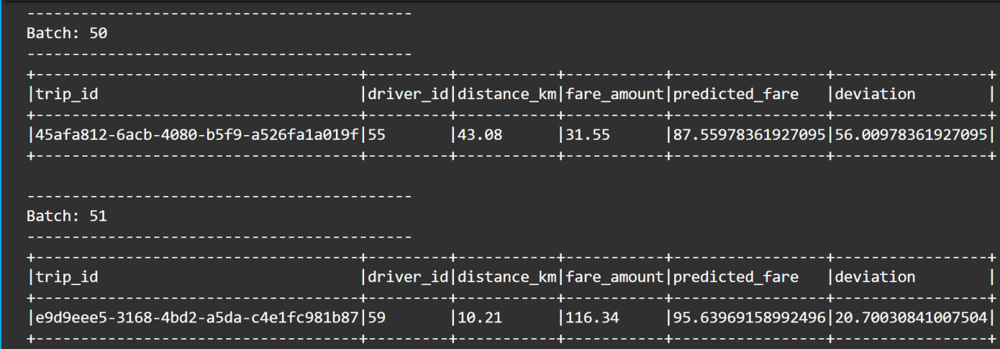
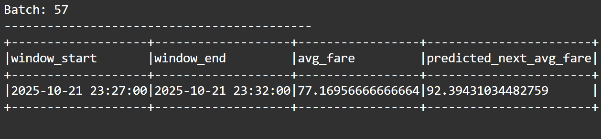

# Handson-L10-Spark-Streaming-MachineLearning-MLlib

**Course:** Cloud Computing for Data Analysis — ITCS 6190/8190 (Fall 2025)  
**Instructor:** Marco Vieira  
**Student:** Sasi Vadana Atluri  
**Assignment:** Real-Time Ride-Sharing Analytics  

---

##  Overview

This project demonstrates a **real-time data analytics pipeline** for a ride-sharing platform using **Apache Spark Structured Streaming** and **MLlib**.

You will:
- Simulate real-time ride events through a socket stream.
- Train regression models with Spark MLlib.
- Perform **real-time inference** to predict fares and fare trends.

---

##  Repository Structure

```
Handson-L10-Spark-Streaming-MachineLearning-MLlib/
├── task4_fare_prediction.py         # Real-time fare prediction
├── task5_fare_trend_prediction.py   # Time-based fare trend prediction
├── data_generator.py                # Optional fake-data streamer (JSON)
├── models/                          # Saved MLlib models
├── checkpoints/                     # Spark checkpoints
├── training-dataset.csv             # Static training data
└── README.md                        # Project documentation
```

---

## ⚙️ Setup Instructions

### 1️ Environment Requirements

Install dependencies:

```bash
pip install pyspark faker
```

Verify installation:

```bash
python -m pyspark --version
```

---

### 2️ Launch Spark Application

Each task runs a Spark Structured Streaming job that reads JSON data via a **socket source** on port `9999`.

Start a socket listener in one terminal:

```bash
nc -lk 9999
```

In another terminal, start the desired task:

```bash
# For real-time fare prediction
python task4_fare_prediction.py

# For time-based fare trend prediction
python task5_fare_trend_prediction.py
```

---

##  Task 4 — Real-Time Fare Prediction

### 🧩 Objective
Predict **fare amount** in real time from **trip distance** using a Linear Regression model.

### 🧠 Workflow
1. Load and preprocess `training-dataset.csv`.
2. Train `LinearRegression(distance_km → fare_amount)`.
3. Save model to `models/ride_fare_predictor`.
4. Stream live trip data and compute:
   - `prediction`
   - `deviation = |fare_amount - prediction|`


###  Output Screenshot — Task 4



##  Task 5 / 7 — Time-Based Fare Trend Prediction

###  Objective
Predict **average fare trends** over 5-minute windows using temporal features.

###  Workflow
1. Aggregate training data into 5-minute windows → compute `avg_fare`.
2. Extract time features:
   - `hour_of_day`
   - `minute_of_hour`
3. Train a `LinearRegression` model on these features.
4. Stream live trip data, window it the same way, and output:
   - `avg_fare`
   - `predicted_next_avg_fare`
   
### 📸 Output Screenshot — Task 5



##  Testing with Data Generator

You can automatically stream fake rides using `data_generator.py`:

```bash
python data_generator.py
```

It sends random JSON records like:
```json
{"trip_id": "T102", "driver_id": 9, "distance_km": 7.5,
 "fare_amount": 18.2, "timestamp": "2025-10-21T23:20:00Z"}
```

---


## 🧾 References
- [Apache Spark Structured Streaming](https://spark.apache.org/docs/latest/structured-streaming-programming-guide.html)
- [Apache Spark MLlib Guide](https://spark.apache.org/docs/latest/ml-guide.html)
- [PySpark API Docs](https://spark.apache.org/docs/latest/api/python/)

---

###  Author
**Atluri Sasi Vadana**  
University of North Carolina at Charlotte  
Email: *satluri2@charlotte.edu*
